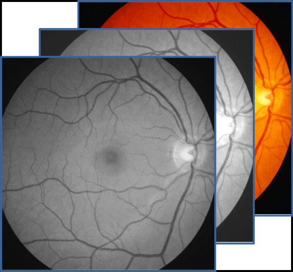

<p align="center">
  
</p>
    A tool to easily merge co-registered retinal images in the Near Infra-red, Auto-fluorescence and Color fundus modalities. The tool creates a single file including the three modalities so that they can be uploaded on Grand Challenge and the RPD quantification algorithm can make predictions.

[ View Demo ](https://github.com/ordnalessa/stack-image-modalities) 
[ Report Bug ](https://github.com/ordnalessa/stack-image-modalities/issues) 
[ Request Feature ](https://github.com/ordnalessa/stack-image-modalities/issues) 


<!-- TABLE OF CONTENTS -->
## Table of Contents

* [Instructions for Windows systems](#instructions-Windows)
* [Instructions for Linux systems](#instructions-linux)


## Instructions (Windows)

1. Download the executable [StackImages.exe](https://github.com/ordnalessa/stack-image-modalities/raw/main/StackImages.exe) from this repository.
1. Create four directories and name them as you wish.
  1. Save one image modality in the three input folders. 
    * Make sure that image modalities of the same eye have the same filename.
  1. Leave the fourth folder empty. 
    * The merged image modalities will be saved here.
  1. The folder structure should look like the following scheme:
```
.
├── Near-Infrared Reflectance     # folder with NIR images
  ├── P001_OD.tiff
  └── ...
├── Fundus Autofluorescence       # folder with FAF images
  ├── P001_OD.tiff
  └── ...
├── Color Fundus Photography      # folder with CFP images 
  ├── P001_OD.tiff
  └── ...
└── Output                        # empty output folder
```
1. Open executable file:
2. If requested, allow windows to execute the file by:
 * Click on "More info".
 
    
    
 * Click on "Run anyway".
 
    

3. Point to folders created above.
  * Carefully choose folders for the right modalities.
  
    
    
4. Click on "Next".
5. Check if files contained in folders are correct. If they are, click Continue.


6. Wait for the program to complete.
7. Click Finish.


