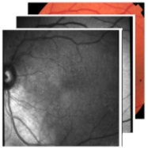

<!--
*** Thanks for checking out this README Template. If you have a suggestion that would
*** make this better, please fork the repo and create a pull request or simply open
*** an issue with the tag "enhancement".
*** Thanks again! Now go create something AMAZING! :D
-->


<!-- PROJECT SHIELDS -->
<!--
*** I'm using markdown "reference style" links for readability.
*** Reference links are enclosed in brackets [ ] instead of parentheses ( ).
*** See the bottom of this document for the declaration of the reference variables
*** for contributors-url, forks-url, etc. This is an optional, concise syntax you may use.
*** https://www.markdownguide.org/basic-syntax/#reference-style-links
-->

<!-- PROJECT LOGO -->
<br />
<p align="center">
  <a href="https://github.com/othneildrew/Best-README-Template">
    
  </a>

  <h3 align="center">Stack multimodal retinal images</h3>

  <p align="center">
    A tool to easily merge co-registered retinal images in the Near Infra-red, Auto-fluorescence and Color fundus modalities. The tool creates a single file including the three modalities so that they can be uploaded on Grand Challenge and the RPD quantification algorithm can make predictions.
    <br />
    <a href="https://github.com/ordnalessa/stack-image-modalities"><strong>Explore the docs »</strong></a>
    <br />
    <br />
    <a href="https://github.com/ordnalessa/stack-image-modalities">View Demo</a>
    ·
    <a href="https://github.com/ordnalessa/stack-image-modalities/issues">Report Bug</a>
    ·
    <a href="https://github.com/ordnalessa/stack-image-modalities/issues">Request Feature</a>
  </p>
</p>


<!-- TABLE OF CONTENTS -->
## Table of Contents

* [Instructions for Windows systems](#Instructions (Windows))
* [Instructions for Linux systems](#Instructions (Linux))
  * [Prerequisites](#prerequisites)
  * [Installation](#installation)
* [Usage](#usage)
* [Roadmap](#roadmap)
* [Contributing](#contributing)
* [License](#license)
* [Contact](#contact)
* [Acknowledgements](#acknowledgements)


## Instructions (Windows)

1. Download the executable [StackImages.exe](https://github.com/ordnalessa/stack-image-modalities/raw/main/StackImages.exe) from this repository.
1. Create four directories and name them as you wish.
  1. Save one image modality in the three input folders. 
    * Make sure that image modalities of the same eye have the same filename.
  1. Leave the fourth folder empty. 
    * The merged image modalities will be saved here.
  1. The folder structure should look like the following scheme:
```
.
├── Near-Infrared Reflectance     # folder with NIR images
  ├── P001_OD.tiff
  └── ...
├── Fundus Autofluorescence       # folder with FAF images
  ├── P001_OD.tiff
  └── ...
├── Color Fundus Photography      # folder with CFP images 
  ├── P001_OD.tiff
  └── ...
└── Output                        # empty output folder
```
1. Run executable file.
1. Point to folders created above.
  * Carefully choose folders for the right modalities.
1. Click on Next.
1. Check if files contained in folders are correct. If they are, click Continue.
1. Wait for the program to complete.
1. Click Finish.
