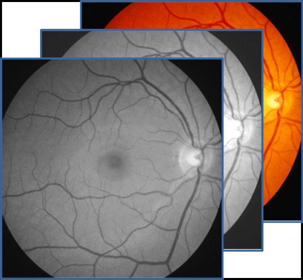
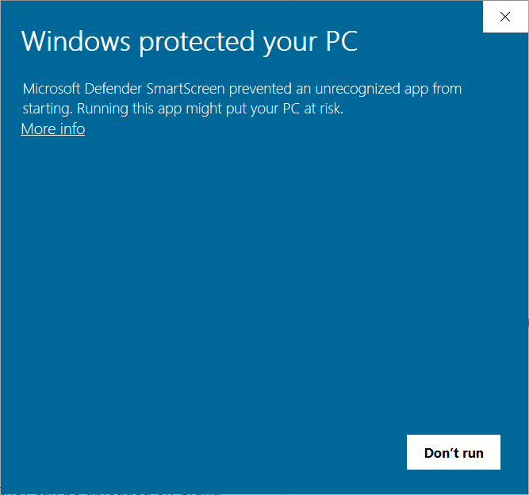
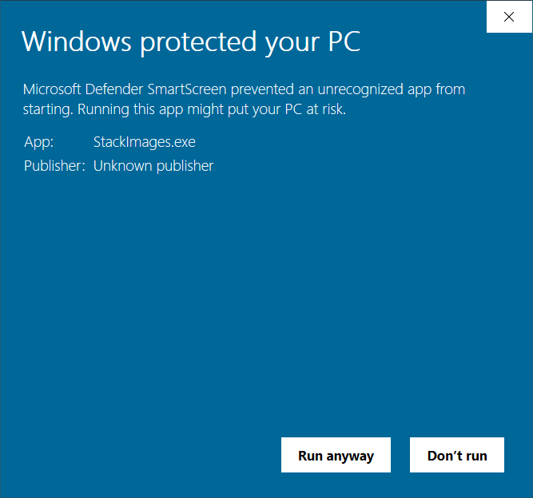
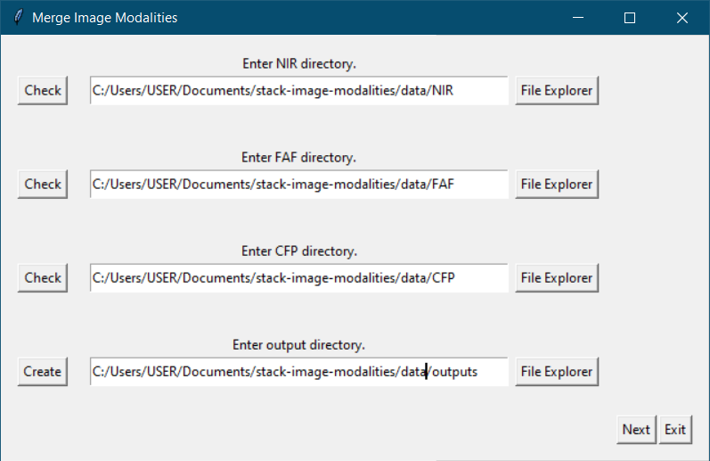
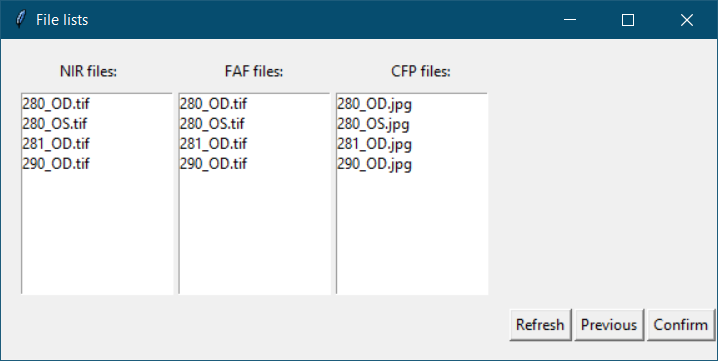
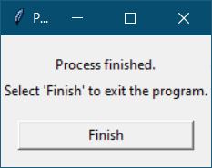

<p align="center">
  
</p>
    A tool to easily merge co-registered retinal images in the Near Infra-red, Auto-fluorescence and Color fundus modalities. The tool creates a single file including the three modalities so that they can be uploaded on Grand Challenge and the RPD quantification algorithm can make predictions.

[ View Demo ](https://github.com/ordnalessa/stack-image-modalities) 
[ Report Bug ](https://github.com/ordnalessa/stack-image-modalities/issues) 
[ Request Feature ](https://github.com/ordnalessa/stack-image-modalities/issues) 


## Table of Contents

* [Instructions for Windows systems](#instructions-Windows)
* [Instructions for Linux systems](#instructions-linux)


## Instructions (Windows)

### Preparation

1. Download the executable [StackImages.exe](https://github.com/ordnalessa/stack-image-modalities/raw/main/StackImages.exe) from this repository.
1. Create four directories and name them as you wish.
  1. Save one image modality in the three input folders. 
    * Make sure that image modalities of the same eye have the same filename.
  1. Leave the fourth folder empty. 
    * The merged image modalities will be saved here.
  1. The folder structure should look like the following scheme:
```
.
├── Near-Infrared Reflectance     # folder with NIR images
  ├── P001_OD.tiff
  └── ...
├── Fundus Autofluorescence       # folder with FAF images
  ├── P001_OD.tiff
  └── ...
├── Color Fundus Photography      # folder with CFP images 
  ├── P001_OD.tiff
  └── ...
└── Output                        # empty output folder
```

### Usage

1. Open executable file:
2. If requested, allow windows to execute the file by:
 * Click on "More info".

<p align="left">
  
</p> 
    
 * Click on "Run anyway".
 
<p align="left">
  
</p> 

3. Point to folders created above.
  * Carefully choose folders for the right modalities.
  
<p align="left">
  
</p>    

4. Click on "Next".
5. Check if files contained in folders are correct. If they are, click "Confirm".

<p align="left">
  
</p>  

6. Wait for the program to complete.
7. Click "Finish".

<p align="left">
  
</p>  

## Instructions (Linux)

## Contribute

To include new changes in the executable, run this command in your terminal:

```
pyinstaller --onefile --windowed --icon=images/app_icon.ico --name=StackImages main.py 
```
